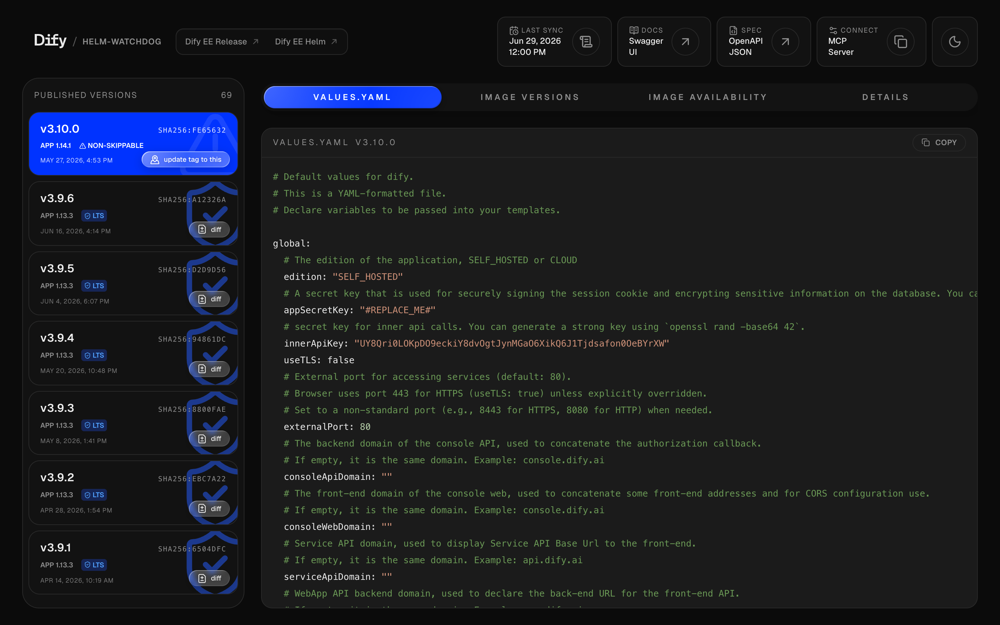
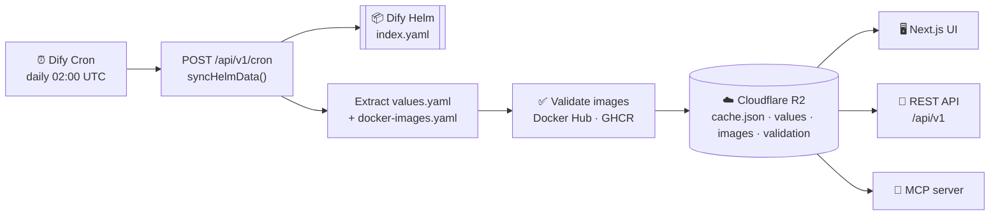
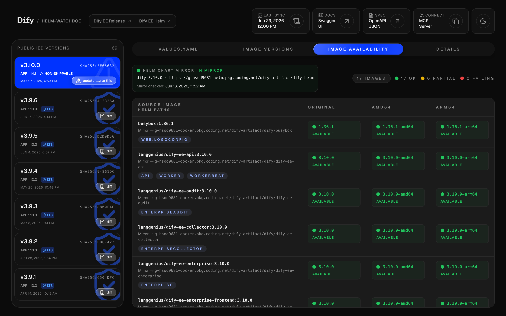

<div align="center">

# 🛰️ Dify Helm Watchdog

### Never get surprised by a Dify Helm chart upgrade again.

**Daily snapshots of every [Dify Helm chart](https://langgenius.github.io/dify-helm) — `values.yaml`, container images, and cross-arch image validation.** Browse it in a cyber-dark UI, pull it from a REST API, or wire it straight into your AI agent over MCP.

<br/>

[](https://helm-watchdog.dify.ai)
[](https://helm-watchdog.dify.ai)
[](https://helm-watchdog.dify.ai)
[](LICENSE)
[](https://github.com/sorphwer/dify-helm-watchdog/stargazers)

[🌐 **Live Demo**](https://helm-watchdog.dify.ai) · [📖 **API Docs**](dify-helm-watchdog/docs/API.md) · [🔌 **Swagger**](https://helm-watchdog.dify.ai/swagger) · [🤖 **MCP**](#-mcp-model-context-protocol) · [📊 **Dashboard**](https://helm-watchdog.dify.ai/dashboard)

<br/>

<a href="https://helm-watchdog.dify.ai"></a>

</div>

---

## ✨ Why

Upgrading a self-hosted Dify deployment means diffing `values.yaml`, hunting down the exact set of container images a chart version ships, and praying every one of them actually exists for your architecture. **Dify Helm Watchdog does that for you, every day, and keeps the history.**

|  |  |
|---|---|
| 📦 **Version tracking** | Daily snapshots of **every** published chart version — currently 69+ and counting |
| 📄 **`values.yaml` archive** | Pull the exact `values.yaml` for any version that ever shipped |
| 🐳 **Image inventory** | Full container-image list per version, as JSON or YAML |
| ✅ **Cross-arch validation** | Verifies every image exists across `linux/amd64` **and** `linux/arm64` |
| 🔀 **Version diffing** | Side-by-side diff between any two chart versions, right in the UI |
| 🤖 **MCP server** | Native Model Context Protocol — give your AI agent live chart knowledge |
| 🔌 **REST API** | [Google-AIP](https://google.aip.dev)-styled, OpenAPI-documented, CDN-cached |
| 🧙 **Values wizard** | Merge your overrides into a new chart version with image tags auto-enforced |


---

## 🏗️ Architecture

A daily cron snapshots the chart, validates its images, and persists everything to object storage. The UI, REST API, and MCP server all read from that single cache.



---

## 📡 REST API

Base URL: **`https://helm-watchdog.dify.ai`** · base path: `/api/v1` · spec: [`/openapi.json`](https://helm-watchdog.dify.ai/openapi.json) · explorer: [`/swagger`](https://helm-watchdog.dify.ai/swagger)

| Method | Endpoint | Description |
|--------|----------|-------------|
| `GET` | `/api/v1/versions` | List all chart versions · `?includeValidation=true` for stats |
| `GET` | `/api/v1/versions/latest` | Latest version · `?versionOnly=true` → plain text |
| `GET` | `/api/v1/versions/{version}` | Version metadata (appVersion, digest, skippable…) |
| `GET` | `/api/v1/versions/{version}/images` | Image list · `?format=yaml` · `?includeValidation=true` |
| `GET` | `/api/v1/versions/{version}/values` | Download `values.yaml` |
| `GET` | `/api/v1/versions/{version}/validation` | Cross-arch image validation report |
| `POST` | `/api/v1/cron` | Trigger a sync (Bearer-auth when `CRON_API_KEY` is set) |
| `POST` `GET` | `/api/v1/mcp` · `/api/v1/sse` | MCP transports (see below) |

```bash
# What's the newest chart?
curl https://helm-watchdog.dify.ai/api/v1/versions/latest?versionOnly=true
# → 3.10.0

# Grab a version's values.yaml
curl https://helm-watchdog.dify.ai/api/v1/versions/3.10.0/values -o values-3.10.0.yaml

# List its images as YAML
curl 'https://helm-watchdog.dify.ai/api/v1/versions/3.10.0/images?format=yaml'
```

Full reference → [`docs/API.md`](dify-helm-watchdog/docs/API.md).

---

## 🤖 MCP (Model Context Protocol)

Expose live Dify chart knowledge to any MCP-capable agent (Claude, Cursor, etc.).

```jsonc
{
  "mcpServers": {
    "dify-helm-watchdog": {
      "url": "https://helm-watchdog.dify.ai/api/v1/mcp"
    }
  }
}
```

**Tools:** `list_versions` · `get_latest_version` · `get_version_details` · `list_images` · `validate_images`
**Resources:** `helm://versions` · `helm://versions/{version}/values` · `.../images` · `.../validation`
**Prompts:** `update_enterprise_to_version` · `analyze_missing_images`
**Transports:** Streamable HTTP (`POST /api/v1/mcp`) · SSE (`GET /api/v1/sse`)

---

## ✅ Image Validation

Every image referenced by a chart version is resolved against its registry (Docker Hub, GHCR) and checked per-platform. Results aggregate to `ALL_FOUND` / `PARTIAL` / `MISSING` / `ERROR` so you know before you `helm upgrade`.

<div align="center">

</div>

---

## 🛠️ Tech Stack


Next.js 15 (App Router) · React 19 · TypeScript (strict) · Tailwind CSS v4 + shadcn/ui · ECharts · Cloudflare R2 · `@modelcontextprotocol/sdk` · Jest · deployed on Vercel.

---

## 🤝 Contributing

Issues and PRs welcome. Before opening a PR: `yarn lint`, `yarn test`, and `yarn build` should all pass. New API endpoints follow the [Google AIP](https://google.aip.dev) conventions and need a matching test under `src/test/`.


---

## 📄 License

[Apache 2.0](LICENSE) © [sorphwer](https://github.com/sorphwer)

<div align="center"><sub>Built for the Dify self-hosting community. Not an official Dify / LangGenius project.</sub></div>
